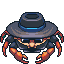

<div align="center">
  
  <h1>Crabspy</h1>
  <p>A real-time multi-crab social deduction game.
</div>

---

## Huh?

One player is secretly the **Crabspy** — they don't know the location. Everyone else does. Players take turns asking each other suspicious questions, trying to sniff out the spy without giving the location away. The spy just has to survive or guess correctly.

## Stack

- **Go**
- **Templ**
- **Datastar**
- **SQLite**
- **Open Props**

## Running locally

Requires: `go`, `templ`, `air`, `sqlc`

```bash
# Generate code and start with hot reload
task
```

Or manually:

```bash
templ generate
go run ./cmd/main.go
```

Set the following env vars (or use a `.env` file):

```env
CRABSPY_COOKIE_STORE_SECRET_KEY=your-secret-here
CRABSPY_PORT=3012
CRABSPY_DB_PATH=./data/crabspy.db
```

## Docker

```bash
docker build -t crabspy .
docker run -p 3012:3012 -v ./data:/app/data crabspy
```

## Artists 

- **Nova Pratiwi** — Location card art ([Fiverr](https://www.fiverr.com/novapratiwi))
- **Singapura** — Splash screen art ([Artstation](https://www.artstation.com/singarts))
- **LorienPixel** — Pixel crab art ([@LorienPixel](https://x.com/LorienPixel))
